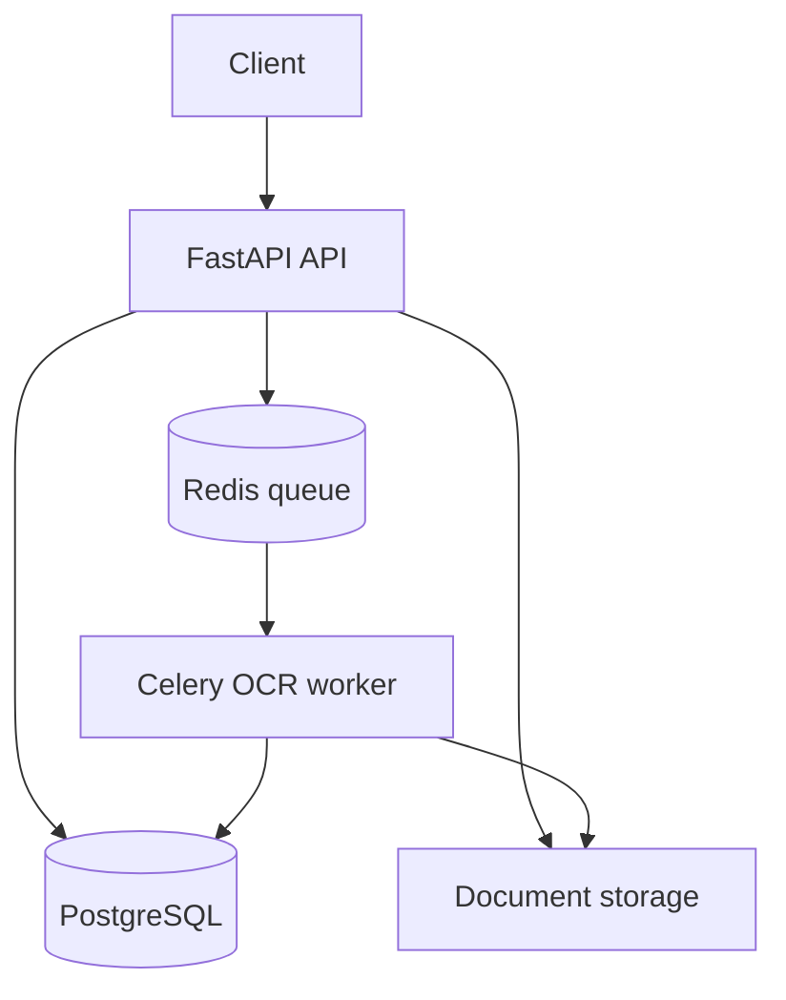

# AI Document Intelligence Platform

A production-style backend that uploads documents, extracts text with PDF parsing or OCR, classifies document types, extracts structured fields, and provides secure search and processing APIs.

## Highlights

- JWT authentication and user roles
- PDF, PNG, JPEG, TXT, and Markdown uploads
- PDF text extraction and Tesseract OCR
- Invoice, receipt, resume, and general document classification
- Email, phone, date, invoice number, total, and skill extraction
- Confidence scores and processing errors
- Celery background workers with Redis
- PostgreSQL persistence and local SQLite support
- Full-text keyword search and filters
- Per-user document isolation
- Processing audit logs
- Upload size and MIME-type validation
- Docker Compose architecture
- GitHub Actions CI
- Automated API and extraction tests

## Architecture



## Local setup

```powershell
python -m venv .venv
.venv\Scripts\Activate.ps1
pip install -r requirements.txt
Copy-Item .env.example .env
uvicorn app.main:app --reload
```

Install [Tesseract OCR](https://github.com/tesseract-ocr/tesseract) on the host to process images. PDF documents containing embedded text, TXT, and Markdown work without it.

Open Swagger UI at http://127.0.0.1:8000/docs.

## API endpoints

| Method | Endpoint | Purpose |
|---|---|---|
| POST | `/api/v1/auth/register` | Create an account |
| POST | `/api/v1/auth/login` | Receive a JWT token |
| GET | `/api/v1/auth/me` | View current user |
| POST | `/api/v1/documents` | Upload and process a document |
| GET | `/api/v1/documents` | Search and filter documents |
| GET | `/api/v1/documents/{id}` | View text and extracted fields |
| POST | `/api/v1/documents/{id}/reprocess` | Run extraction again |
| DELETE | `/api/v1/documents/{id}` | Delete document and stored file |
| GET | `/api/v1/dashboard` | Processing statistics |

Login uses form data; enter the email in the `username` field.

## Background processing

Local mode processes synchronously by default. For the production-style queue, set `CELERY_ENABLED=true`, start Redis, and run:

```bash
celery -A app.tasks.celery_app worker --loglevel=info
```

## Docker stack

```bash
docker compose up --build
```

This starts FastAPI, Celery, PostgreSQL, and Redis. Visit http://localhost:8000/docs.

## Tests

```bash
pytest
```

## Security notes

- Files are renamed using random UUIDs.
- Supported MIME types and upload sizes are validated.
- Every document query is scoped to its owner.
- Secrets must be replaced before deployment.
- Production deployments should use object storage, malware scanning, HTTPS, and rate limiting.

## Roadmap

- Sentence-transformer semantic search with pgvector
- Layout-aware extraction using LayoutLM
- Human validation workflow
- Object storage with signed URLs
- WebSocket processing notifications
- Multi-tenant organisations and API keys
- Alembic migrations

## License

MIT
